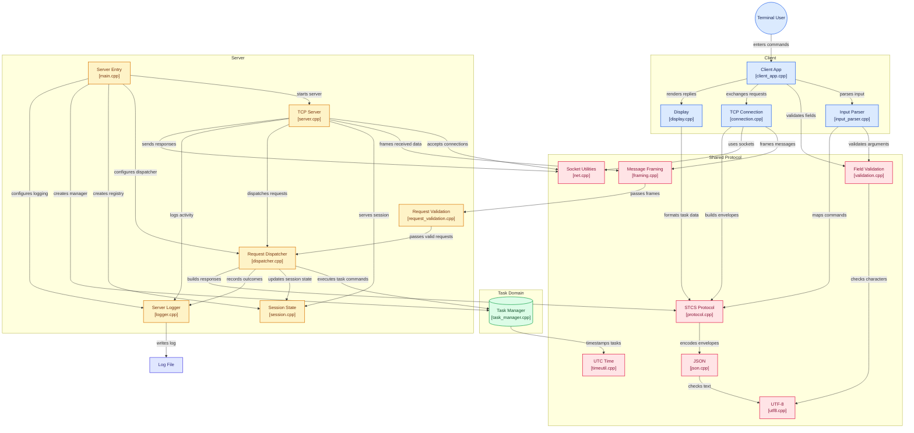

## System Architecture



**Phase 2 (this deliverable) is one client + one server.** The server
deliberately serves one client at a time. Phase 3 adds concurrency; the
protocol does not change (see section 17).

## Features

* TCP sockets only (`socket`, `bind`, `listen`, `accept`, `connect`, `send`,
  `recv`, `close`), no HTTP or networking framework.
* Newline-delimited JSON protocol (the Phase 1 "STCS v1" protocol), with a
  framing layer that handles partial reads, several messages in one read, and
  a message plus a trailing fragment. No `sleep()` or timing assumptions.
* All nine Phase 1 commands: `HELLO`, `HELP`, `LIST_TASKS`, `CREATE_TASK`,
  `CLAIM_TASK`, `RELEASE_TASK`, `COMPLETE_TASK`, `DELETE_TASK`, `QUIT`.
* Session state machine (`CONNECTED`, `READY`, `CLOSING`, `CLOSED`).
* Structured success and error responses with the 12 Phase 1 error codes.
* Timestamped server log (`logs/server.log`), graceful and abrupt disconnect
  handling, clean shutdown on Ctrl-C / SIGTERM.
* Plain-text client interface, within 80 columns.

## Architecture summary

```
shared/   utf8, json, framing, protocol, validation, net, timeutil   (both programs)
server/   logger, session, task_manager, request_validation,
          dispatcher, server (TCP listener + session loop), main
client/   connection, input_parser, display, client_app, main
tests/    test_framing, test_units, test_integration, run_all.sh
docs/     Phase 2 report, protocol spec, diagrams, sample log, test results
```

Request path on the server:
`recv()` -> `MessageFramer` -> envelope + payload validation ->
`RequestDispatcher` -> `TaskManager` (in-memory task store) -> response ->
`send_all()`; every step is logged by `Logger`.
See `docs/STCS_Phase2_Report.docx` section 2 for diagrams.

## Requirements

* Linux or macOS, a C++17 compiler (`g++` 7+ or `clang++`), and `make`.
* No third-party libraries. (Python 3 is *not* needed.)
* Developed and tested with g++ 13.3 on Linux 6.x.

## Compilation

From the project root:

```
make            # builds bin/server and bin/client
make tests      # builds the test programs in build/
make check      # builds everything and runs ALL tests
make clean      # removes build products, binaries and logs
```

(The binaries are in `bin/` because the source directories are already named
`server/` and `client/`.)

## Starting the server

```
./bin/server <port> [log_file]
./bin/server 5050
```

## Starting the client

```
./bin/client <host> <port> <display_name>
./bin/client 127.0.0.1 5050 Ana
```

## Command-line arguments

| Program | Argument | Meaning |
|---|---|---|
| server | `port` | TCP port to listen on, 1-65535 (required) |
| server | `log_file` | log path (optional; default `logs/server.log`, relative to the current directory; the `logs/` directory is created if missing) |
| client | `host` | hostname or IPv4 address of the server |
| client | `port` | server port, 1-65535 (validated before any connection is attempted) |
| client | `display_name` | 1-24 characters: letters, digits, space, `_`, `-`, `.`; quote it if it has spaces |

Exit codes: `0` normal; `1` runtime failure (cannot connect, connection lost,
cannot bind); `2` bad command-line arguments.

## Example interaction

Terminal 1:

```
$ ./bin/server 5050
2026-10-04T15:01:17Z INFO Server starting (STCS protocol v1, Phase 2: one client at a time)
2026-10-04T15:01:17Z INFO Logging to logs/server.log
2026-10-04T15:01:17Z INFO Server listening on 0.0.0.0:5050
2026-10-04T15:01:17Z INFO Waiting for a client connection (one active client at a time)
```

Terminal 2:

```
$ ./bin/client 127.0.0.1 5050 Ana
Connecting to 127.0.0.1:5050 ...
Connected.
Session sess-0001 started as 'Ana'.
Type 'help' for a list of commands.
stcs> add
Title (or /cancel): Write methodology section
Priority [LOW/MEDIUM/HIGH, Enter = MEDIUM]: high
Created task 1.
  Title:      Write methodology section
  Priority:   HIGH
  Status:     OPEN
  Claimed by: -
  Created:    by Ana at 2026-10-04T15:01:17Z
stcs> claim 1
Claimed task 1.
  ...
stcs> claim 1
Error [CONFLICT]: Task 1 is already claimed by Ana.
  Hint: Use 'list' to see the current owner and status.
stcs> quit
Session closed. Goodbye.
```

A longer, real, captured session is in `docs/demo_client_ana.txt`
(and `docs/demo_client_ben.txt`), with the matching server log in
`docs/sample_server.log`.

## Supported commands (client prompt)

| Type | What it does | Protocol command |
|---|---|---|
| `help` | local command list (no request sent) | - |
| `help server [COMMAND]` | ask the server for its command list | `HELP` |
| `add [title]` | add a task; prompts for title and priority if not given | `CREATE_TASK` |
| `list [open\|claimed\|done]` | show tasks | `LIST_TASKS` |
| `claim <id>` | take ownership of an OPEN task | `CLAIM_TASK` |
| `release <id>` | return a CLAIMED task to OPEN | `RELEASE_TASK` |
| `done <id>` | mark a task DONE | `COMPLETE_TASK` |
| `delete <id>` | remove a task permanently | `DELETE_TASK` |
| `quit` | end the session and exit | `QUIT` |
| `raw <COMMAND> [json]` | send any command name with a JSON-object payload, to demonstrate server-side errors (e.g. `raw MAKE_COFFEE`) | any |

`HELLO` is sent automatically when the client starts. At an `add`, `claim`,
... prompt, `/cancel` aborts. End-of-input (Ctrl-D) acts like `quit`.

## Error behavior

* **Client side:** bad port/name -> message and exit 2 before any socket is
  created; server not running / unknown host / no answer within 10 s -> plain
  message and exit 1; empty or unknown command, bad task id, bad title or
  priority -> message and re-prompt. No stack traces are ever shown.
* **Server side:** every malformed, invalid or unsupported request gets a
  structured `ERROR` response (`error_code` + human-readable `message`); the
  connection stays open and state is unchanged. Error codes:
  `INVALID_MESSAGE`, `INVALID_VERSION`, `UNKNOWN_COMMAND`, `MISSING_FIELD`,
  `INVALID_FIELD`, `NOT_FOUND`, `CONFLICT`, `INVALID_STATE`, `NAME_IN_USE`,
  `MESSAGE_TOO_LARGE`, `SESSION_ERROR`, `SERVER_ERROR`.
* A client that disappears (QUIT-less close, crash, reset) is detected by
  `recv()` returning 0 or failing; the session is released and the server
  returns to listening. Tasks stay in memory for the life of the server.

## Logging

`logs/server.log` (relative to where the server is started, or the optional
second argument), also echoed to the server terminal. Each line is
`<ISO-8601 UTC timestamp> <LEVEL> <text>`. Logged: startup, listening address
and port, connections (session id + peer address), every request with its
outcome, validation/protocol errors, graceful and unexpected disconnects,
session release, shutdown. Task titles and message contents are **not**
logged; client-supplied text that is logged is sanitised.
`docs/sample_server.log` is a real sample.

## Testing

```
make check
```

runs three suites (a clean run takes a few seconds; it needs free local TCP
ports):

1. `build/test_framing` - framing unit tests (no sockets).
2. `build/test_units` - JSON, validation, envelope, task manager, session
   registry, request dispatcher (driven in-process), client display/input.
3. `build/test_integration` - starts the real `bin/server` and `bin/client`
   and tests over TCP: all nine commands, error cases, partial/coalesced
   messages, abrupt disconnects, signals, and client behaviour.

Each test prints `PASS`/`FAIL` with an ID that matches the Phase 1 test plan
(T-01...T-17) or the Phase 2 additions (U-..., X-...). The saved output of
a real run is `docs/test_results.txt`; the test report is in the Phase 2
report, section 8.

You can also try errors by hand:

```
stcs> raw MAKE_COFFEE                       -> UNKNOWN_COMMAND
stcs> raw CREATE_TASK {"priority":"HIGH"}   -> MISSING_FIELD
stcs> claim 9999                            -> NOT_FOUND
```

## Framing tests

`tests/test_framing.cpp` (no sockets, no sleeps) feeds the framer one byte at
a time, in three pieces, two messages per feed, two messages plus a trailing
fragment, CRLF, blank lines, 8192/8193-byte lines, 48 KiB with no newline, and
200 random chunkings of a message stream. `tests/test_integration.cpp`
(`T-13`, `T-14`, `U-I2`, `U-I3`) repeats the key cases over a real TCP
connection. TCP may coalesce small writes, so the socket tests assert
correctness of the result (exactly one reply per request, in order, no
duplicates), while the unit tests control the chunk boundaries exactly.
